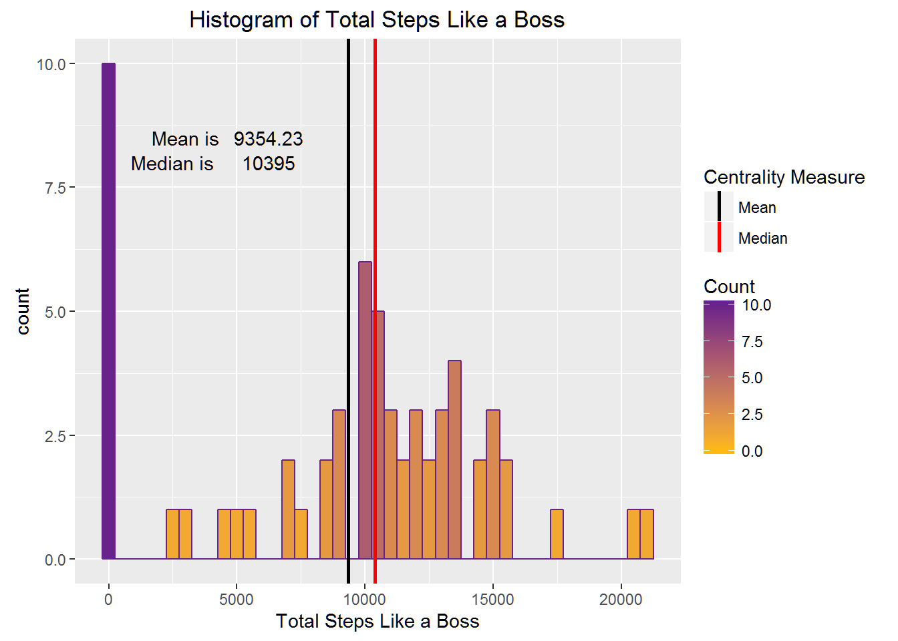
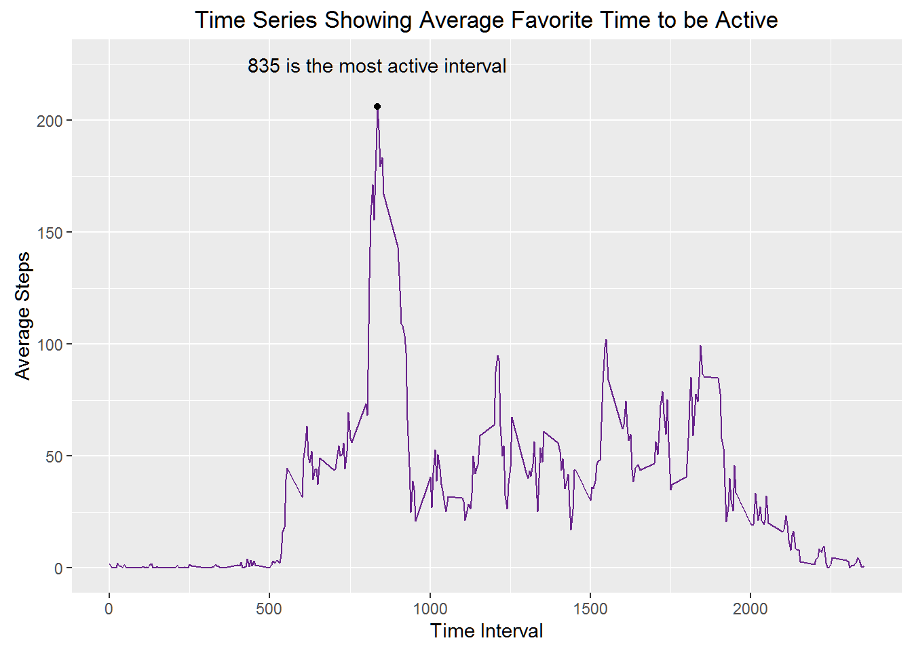
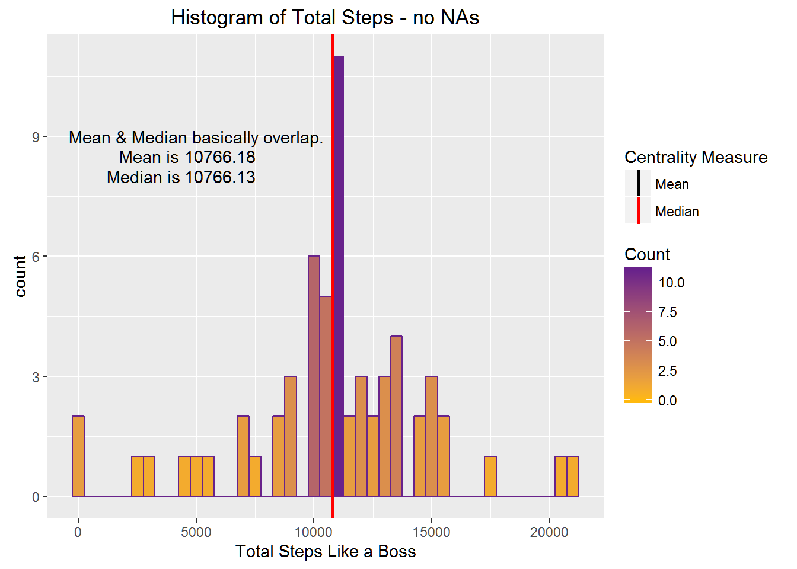
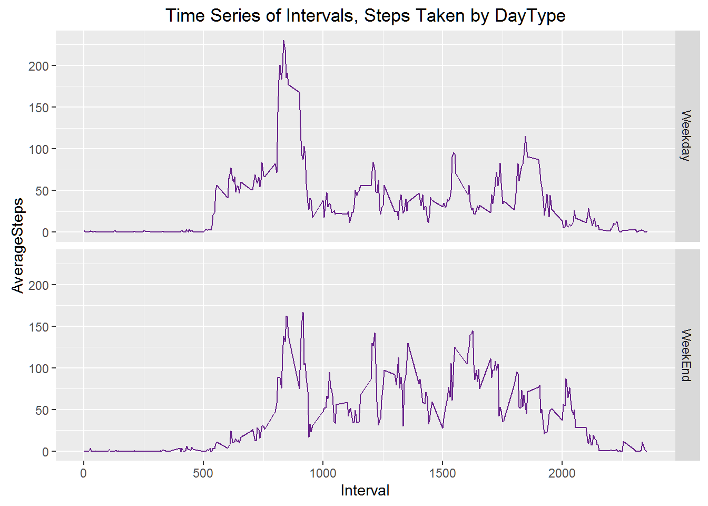

```{r setup, include=FALSE}
knitr::opts_chunk$set(echo=TRUE)
```

## Work for Project 1 in Reproducible Research

This project uses data pulled from a device that tracks the number of steps someone took over the course of a day. Data was sampled at 5 minute intervals during the months of October and November 2012.

## Data

The data came from the course site: [Activity monitoring data - 52k]( https://d396qusza40orc.cloudfront.net/repdata%2Fdata%2Factivity.zip)

The variables covered are:

* steps: Number of steps taking in a 5-minute interval (missing values are coded as NA)

* date: The date on which the measurement was taken in YYYY-MM-DD format

* interval: Identifier for the 5-minute interval in which measurement was taken

The 17,568 observations in this dataset are stored in a CSV.

## Assignment

1. Load the data (i.e. read.csv())

2. Process/transform the data (if necessary) into a suitable format. 

```{r Activity}
library(dplyr)
library(ggplot2)
unzip("activity.zip")
mydata <- read.csv("activity.csv",stringsAsFactors=FALSE, 
                   na.strings="Not Available", 
                   colClasses=c("numeric","Date","numeric"),
                   sep=",")
stepsPerDay <- group_by(mydata, date)
sumStepsPerDay <- summarize(stepsPerDay, sum(steps, na.rm=TRUE))
colnames(sumStepsPerDay) <- c("Date", "TotalSteps")

# Gets the mean and the median - since we use it twice, and would like to comment on it.
mn <- round(mean(sumStepsPerDay$TotalSteps, na.rm=T), 2)
md <- round(median(sumStepsPerDay$TotalSteps, na.rm=T), 2)
```

## Histogram

### What is mean total number of steps taken per day?

1. Make a histogram of the total number of steps taken each day.

2. Calculate and report the mean and median total number of steps taken per day.

Presenting the code for this plot since it answers questions 1 and 2.

```{r histogram, echo=TRUE}
g <-ggplot(sumStepsPerDay, aes(x=TotalSteps)) + 
        geom_histogram(binwidth=500, col="darkorchid4", aes(fill=..count..)) + 
        scale_fill_gradient("Count", low ="darkgoldenrod1", high ="darkorchid4") + 
        labs(x = "Total Steps Like a Boss") + 
        labs(title = "Histogram of Total Steps Like a Boss") + 
        geom_vline(aes(xintercept=mn, color="Mean"), size=1, show.legend = T) + 
        geom_vline(aes(xintercept=md, color="Median"), size=1, show.legend = T) +
        scale_colour_manual(name="Centrality Measure", values=c(Mean="black", Median="red")) +
        annotate("text",label="Mean is", x=3000, y=8.5) +
        annotate("text",label=mn, x=6250, y=8.5) +
        annotate("text",label="Median is", x=2500, y=8) +
        annotate("text",label=md, x=6250, y=8)
```



### What's the average daily pattern?

1. Make a time series plot (i.e. type = "l") of the 5-minute interval (x-axis) and the average number of steps taken, averaged across all days (y-axis)

2. Which 5-minute interval, on average across all the days in the dataset, contains the maximum number of steps? The answer is 835. Here's the code used to derive that answer:

```{r echo=TRUE}
maxInterval <- group_by(mydata, interval)
aveStepsInterval <- summarize(maxInterval, round(mean(steps, na.rm=TRUE), 2))
colnames(aveStepsInterval) <- c("Interval", "AverageSteps")
mostStepsTaken <- max(aveStepsInterval$AverageSteps)
busiestInterval <- subset(aveStepsInterval, AverageSteps==206.17, select=Interval)
```

Which is the busiest interval?
```{r echo=TRUE}
cat(busiestInterval$Interval)
```

And now for the graph:

```{r linegraph, echo=TRUE}
g1 <-ggplot(aveStepsInterval, aes(x=Interval, y=AverageSteps)) + 
        geom_line(col="darkorchid4") + 
        geom_point(aes(busiestInterval$Interval, mostStepsTaken)) +
        labs(x = "Time Interval") +
        labs(y = "Average Steps") +
        labs(title = "Time Series Showing Average Favorite Time to be Active") +
        annotate("text",label="835 is the most active interval", x=busiestInterval$Interval, y=225)
```


### Imputing missing values

Note that there are missing values for number of days/intervals, (coded as NA). This may introduce bias into some calculations or summaries.

1. Calculate and report the total number of missing values in the dataset (i.e. the total number of rows with NAs)

```{r echo=TRUE}
missing <- sum(is.na(mydata$steps))
```

2. Devise a strategy for filling in all of the missing values in the dataset. The strategy does not need to be sophisticated. For example, use the mean/median for that day, or the mean for that 5-minute interval, etc.

```{r echo=TRUE}
# Create a new dataset to work with.
mydata1 <- mydata

# Get the vector of intervals with missing steps
interval.na <- mydata$interval[is.na(mydata$steps)]

# Get corresponding location of steps in aveStepsInterval
index <- sapply(interval.na, function(x) which(aveStepsInterval$Interval==x))

# Replace NA values with corresponding values in aveStepsInterval
mydata1$steps[is.na(mydata1$steps)] <- aveStepsInterval$AverageSteps[index]
```

3. Create a new dataset that is equal to the original dataset but with the missing data filled in.

See the code above, in which it is created. The code below proves that the new dataset has no NAs.


```{r echo=TRUE}
sum(is.na(mydata1$steps))
```

4. Make a histogram of the total number of steps taken each day and Calculate and report the mean and median total number of steps taken per day. Do these values differ from the estimates from the first part of the assignment? What is the impact of imputing missing data on the estimates of the total daily number of steps?

Here is the code and answers for the mean (first one) and the median(the second one).
```{r echo=TRUE}

# Round 2: histogram of tot steps per day, mean median etc.
stepsPerDay1 <- group_by(mydata1, date)
sumStepsPerDay1 <- summarize(stepsPerDay1, sum(steps, na.rm=TRUE))
colnames(sumStepsPerDay1) <- c("Date", "TotalSteps")
mn1 <- round(mean(sumStepsPerDay1$TotalSteps), 2)
md1 <- round(median(sumStepsPerDay1$TotalSteps), 2)
mn1
md1

```

Here is the histogram (and code) showing the distribution with all the data filled in.
```{r echo=TRUE}
g2 <-ggplot(sumStepsPerDay1, aes(x=TotalSteps)) + 
        geom_histogram(binwidth=500, col="darkorchid4", aes(fill=..count..)) + 
        scale_fill_gradient("Count", low ="darkgoldenrod1", high ="darkorchid4") + 
        labs(x = "Total Steps Like a Boss") + 
        labs(title = "Histogram of Total Steps - no NAs") + 
        geom_vline(aes(xintercept=mean(sumStepsPerDay1$TotalSteps), color="Mean"), size=1, show.legend = T) + 
        geom_vline(aes(xintercept=median(sumStepsPerDay1$TotalSteps), color="Median"), size=1, show.legend = T) +
        scale_colour_manual(name="Centrality Measure", values=c(Mean="black", Median="red")) +
        annotate("text",label="Mean & Median basically overlap.", x=5000, y=9) +
        annotate("text",label="Mean is", x=3000, y=8.5) +
        annotate("text",label=round(mean(sumStepsPerDay1$TotalSteps),2), x=6000, y=8.5) +
        annotate("text",label="Median is", x=2750, y=8) +
        annotate("text",label=round(median(sumStepsPerDay1$TotalSteps),2), x=6000, y=8) 
```



### Are there differences in activity patterns between weekdays and weekends?

*Use:*

* the weekdays() function 

* the "filled-in" dataset

*Tasks:*

1. Create a new factor variable in the dataset with two levels -- "weekday" and "weekend" indicating whether a given date is a weekday or weekend day.

```{r echo=TRUE}
# Moving on to last question: Find out the day of the week.
mydata1 <- mutate(mydata1, day = weekdays(date))
mydata1 <- mydata1 %>% mutate(daytype = ifelse(day %in% c("Saturday", "Sunday"), "WeekEnd", "Weekday"))
mydata1$daytype <- as.factor(mydata1$daytype)
```

2. Make a panel plot containing a time series plot (i.e. type = "l") of the 5-minute interval (x-axis) and the average number of steps taken, averaged across all weekday days or weekend days (y-axis). 

Adjust the data some more:
```{r echo=TRUE}
maxInterval1 <- group_by(mydata1, daytype, interval)
aveStepsInterval1 <- summarize(maxInterval1, round(mean(steps, na.rm=TRUE), 2))
colnames(aveStepsInterval1) <- c("DayType", "Interval", "AverageSteps")
```

Here's the plot:
```{r echo=TRUE}
# It's a plot! And a none too original joke!
g3 <-ggplot(aveStepsInterval1, aes(x=Interval, y=AverageSteps)) + 
        geom_line(col="darkorchid4") + 
        facet_grid(DayType ~ .) +
        labs(title="Time Series of Intervals, Steps Taken by DayType")
```

